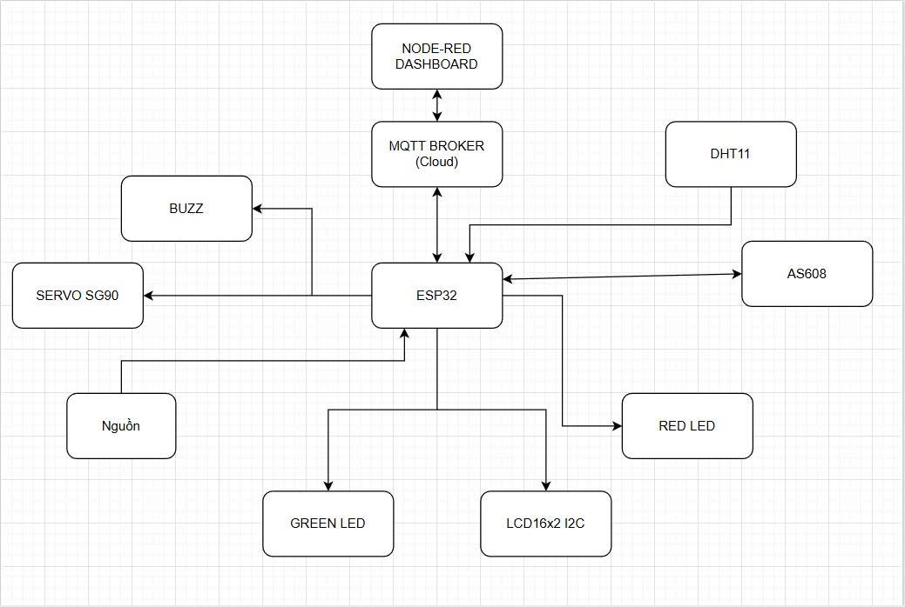
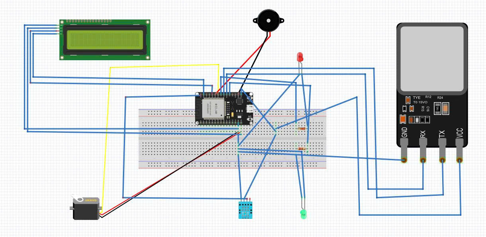
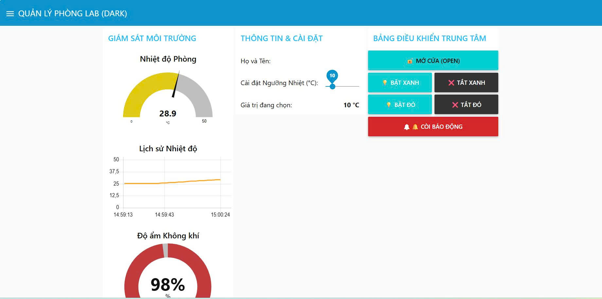
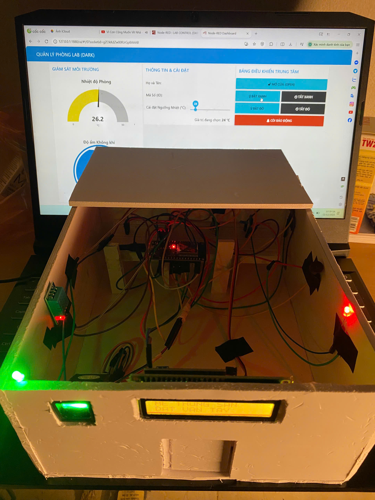

#  Quản lý phòng Lab

> **Bài tập cuối kỳ:** Phát triển ứng dụng IoT

> **Sinh viên thực hiện:** Trần Văn Hiển

> **Ngành:** Kỹ thuật Điện tử và Tin học

> **Mã sinh viên:** 22001320

---

##  Mục Lục
1. [Đặt vấn đề](#1-đặt-vấn-đề)
2. [Giải pháp & Tính năng](#2-giải-pháp--tính-năng)
3. [Phần cứng sử dụng](#3-phần-cứng-sử-dụng)
4. [Sơ đồ kết nối](#4-sơ-đồ-kết-nối)
5. [Cài đặt phần mềm](#5-cài-đặt-phần-mềm)
6. [Hình ảnh & Video kết quả](#6-hình-ảnh--video-kết-quả)
7. [Kết luận & Hướng phát triển](#7-kết-luận--hướng-phát-triển)

---

## 1. Đặt vấn đề

Trong bối cảnh cuộc Cách mạng công nghiệp 4.0 và xu hướng chuyển đổi số tại các trường đại học, phòng thí nghiệm (Phòng Lab) đóng vai trò then chốt trong việc đào tạo và nghiên cứu khoa học. Đây là nơi tập trung nhiều trang thiết bị đắt tiền, máy móc kỹ thuật cao và là không gian học tập thường xuyên của sinh viên khối ngành kỹ thuật.
Tuy nhiên, thực trạng quản lý phòng Lab tại nhiều trường đại học hiện nay vẫn còn tồn tại nhiều bất cập do phụ thuộc vào phương thức thủ công truyền thống:

**Về kiểm soát ra vào (An ninh):**
* Việc sử dụng chìa khóa cơ truyền thống gây khó khăn trong việc quản lý người giữ chìa khóa, dễ xảy ra tình trạng mất chìa hoặc sao chép chìa trái phép.
* Không có lịch sử lưu vết chi tiết về thời gian ra/vào của từng cá nhân, gây khó khăn cho việc truy cứu trách nhiệm khi xảy ra sự cố mất mát tài sản hoặc hỏng hóc thiết bị.
  
**Về giám sát môi trường và an toàn thiết bị:**
* Các thiết bị điện tử, server máy chủ trong phòng Lab rất nhạy cảm với nhiệt độ và độ ẩm. Việc không giám sát được môi trường liên tục (24/7) có thể dẫn đến thiết bị quá nhiệt, giảm tuổi thọ hoặc nguy cơ cháy nổ.
* Tình trạng quên tắt đèn, quạt, điều hòa sau giờ học gây lãng phí năng lượng điện năng rất lớn cho nhà trường.
**Mục tiêu của dự án:**
Xây dựng một hệ thống IoT tích hợp "2 trong 1":
* Quản lý ra vào/điểm danh bằng sinh trắc học (Vân tay) độ bảo mật cao.
* Giám sát môi trường (Nhiệt độ/Độ ẩm) và điều khiển thiết bị tự động qua Internet.

---

## 2. Giải pháp & Tính năng

Hệ thống sử dụng vi điều khiển **ESP32** kết nối Wifi, giao tiếp với Broker MQTT (EMQX) để gửi dữ liệu về Dashboard trung tâm (Node-RED).

###  Các tính năng chính:
* **Điểm danh vân tay:** Nhận diện vân tay sinh viên (< 1s), hiển thị tên lên màn hình LCD và gửi dữ liệu điểm danh về Web.
* **Cửa tự động:** Điều khiển Servo mở cửa khi vân tay đúng, tự động đóng lại sau 5 giây.
* **Giám sát môi trường:** Đo nhiệt độ/độ ẩm thời gian thực. Tự động bật quạt (Đèn đỏ) khi nhiệt độ vượt ngưỡng cài đặt.
* **Điều khiển từ xa (IoT):**
    * Mở cửa từ xa qua Web.
    * Bật/tắt đèn, còi báo động từ xa.
    * Cài đặt ngưỡng nhiệt độ cảnh báo qua thanh trượt (Slider) trên Dashboard.
* **Bảo mật:** Sử dụng giao thức MQTT over SSL/TLS (Port 8883).

---

## 3. Phần cứng sử dụng

| STT | Tên linh kiện | Chức năng |
| :--- | :--- | :--- |
| 1 | **ESP32 DevKit V1** | Bộ xử lý trung tâm, kết nối WiFi & MQTT. |
| 2 | **Cảm biến vân tay AS608** | Thu thập và xử lý dữ liệu vân tay. |
| 3 | **Servo SG90** | Giả lập cơ cấu đóng/mở cửa. |
| 4 | **LCD 1602 + I2C** | Hiển thị trạng thái, tên sinh viên, thông báo. |
| 5 | **DHT11** | Cảm biến nhiệt độ, độ ẩm. |
| 6 | **LED & Buzzer** | Đèn báo trạng thái (Xanh/Đỏ) và Còi báo động. |

---

## 4. Sơ đồ kết nối

### 🔌 Bảng đấu nối chân (Pinout)

| Thiết bị | Chân thiết bị | Chân ESP32 | Ghi chú |
| :--- | :--- | :--- | :--- |
| **AS608 (Vân tay)** | TX (Dây xanh) | **GPIO 16** (RX2)
| | RX (Dây trắng) | **GPIO 17** (TX2) | |
| **LCD I2C** | SDA | **GPIO 21** | |
| | SCL | **GPIO 22** | |
| **Servo** | Signal (Cam) | **GPIO 18** | Cấp nguồn 5V |
| **DHT11** | Data | **GPIO 23** | |
| **LED Xanh** | (+) | **GPIO 4** | Báo mở cửa |
| **LED Đỏ** | (+) | **GPIO 5** | Báo nhiệt độ cao |
| **Buzzer** | (+) | **GPIO 19** | Còi chíp |

**Sơ đồ kết nối**

---

## 5. Cài đặt phần mềm

### Yêu cầu:
* **VS Code** + Extension **PlatformIO**.
* **Node-RED** (Chạy trên máy tính hoặc Cloud).
* Thư viện Arduino: `Adafruit Fingerprint`, `PubSubClient`, `DHT sensor library`, `LiquidCrystal_I2C`, `ESP32Servo`.

## 6. Hình ảnh & Video kết quả
**Sơ đồ fritzing**

**Giao diện dashboard**

**Mô hình**

###  Video Demo Kết quả
Hệ thống đã hoạt động ổn định. Dưới đây là video demo:

*(Bấm vào hình trên để xem video)*

## 7. Kết luận & Hướng phát triển
   **Kết quả đạt được:**
* Hệ thống hoạt động ổn định trên đường truyền Internet.
* Thời gian phản hồi vân tay nhanh (< 1s).
* Giao diện Web trực quan, điều khiển thời gian thực (Real-time).
* Giải quyết được vấn đề điểm danh hộ và quên tắt thiết bị điện trong phòng.

 **Hướng phát triển (Future Work):**
* Phát triển thêm Mobile App (Android/iOS) thay vì dùng Web.
* Tích hợp Database (MySQL/Firebase) để lưu lịch sử điểm danh lâu dài và xuất báo cáo Excel.
* Bổ sung thêm nhận diện khuôn mặt (FaceID) bằng ESP32-CAM để tăng tính bảo mật
